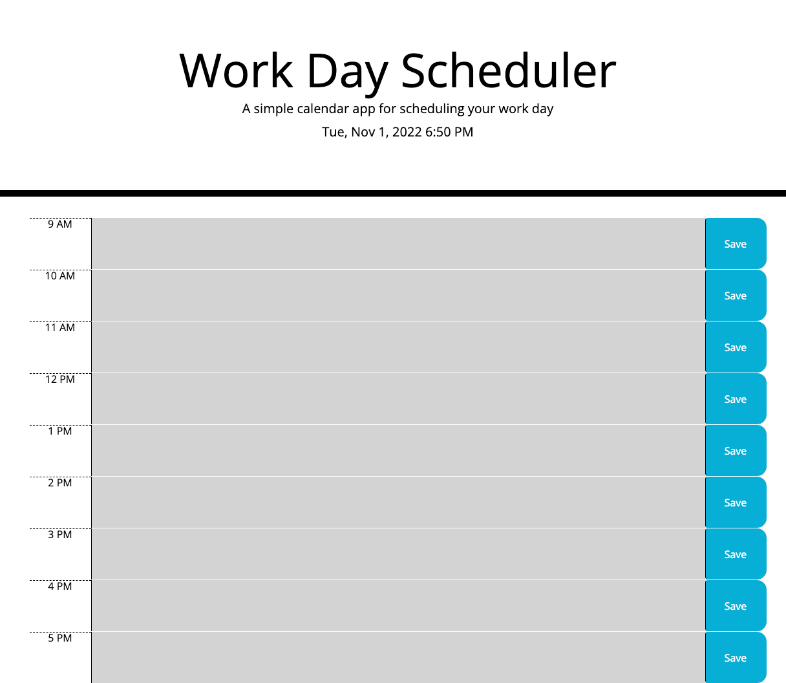

# Work-Day-Scheduler

homework 5

## Description

The goal of this project was to create a functioning work day scheduler that included an 8 hour planner wherein I could save plans for the day, a time clock, and time blocks that displayed past, present and future times. Working with JQuery was definitely something that I had to get used to. There was a lot of different documentation and I found myself having to refer back to the website multiple times in order to get everything to work correctly. The only major difficulty I had working with this project was creating the time block function, as figuring out a way to assign the time to each individual block wasn't something we'd ever encountered before. However, I came out of this project happy with the results.

## Installation

This project can be loaded on your local browser.

## Usage

The script can be found on my Github profile: https://github.com/eddygoto/Work-Day-Scheduler.
The project can be seen on my Github page: https://eddygoto.github.io/Work-Day-Scheduler/.

## Credits

W3 Schools, JQuery documentation, Bootstrap documentation

## License

None
